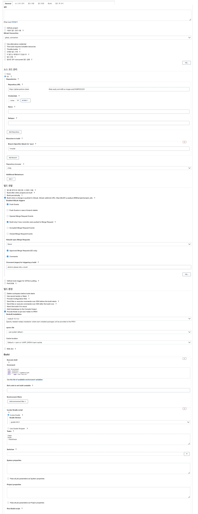
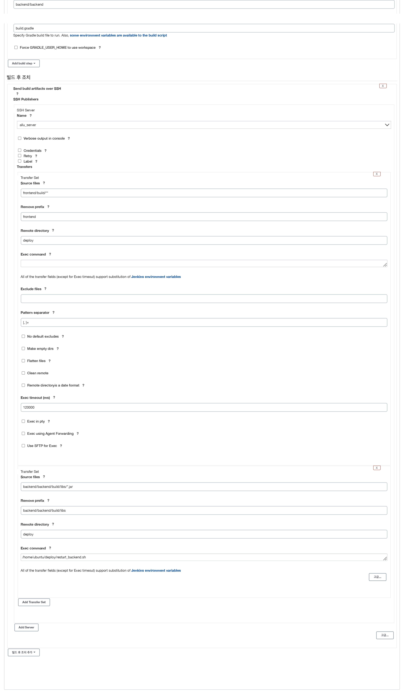

# Deployment

### AI server: Django

```
sudo apt install python3-venv
```

cd AIserver

python3 -m venv venv

가상환경 설정

```bash
$ source venv/bin/activate
$ sudo apt-get install libssl-dev
$ sudo apt-get install mysql-server
$ sudo apt-get install mysql-client
$ sudo apt-get install libmysqlclient-dev
$ sudo apt-get install python3-dev default-libmysqlclient-dev build-essential
$ pip install -r requirements.txt
$ python3 manage.py makemigrations
$ python3 manage.py migrate
$ python3 [manage.py](<http://manage.py>) runserver 0:8000
```

유니콘

```bash
$ pip install gunicorn
$ gunicorn --bind 0.0.0.0:8000 AIserver.wsgi:application
post <http://j6c201.p.ssafy.io:8000/aiserver/image>

$ sudo vi /etc/systemd/system/gunicron.service
[Unit]
Description=gunicorn daemon
After=network.target

[Service]
User=ubuntu
Group=www-data
WorkingDirectory=/home/ubuntu/S06P22C201/backend/AIserver
ExecStart=/home/ubuntu/S06P22C201/backend/AIserver/venv/bin/gunicorn \\
				--workers 3 \\
				--bind 127.0.0.1:8000 \\
				--timeout 600 \\
				AIserver.wsgi:application

[Install]
WantedBy=multi-user.target
sudo systemctl daemon-reload
sudo systemctl start gunicorn
sudo systemctl enable gunicorn
sudo systemctl status gunicorn.service
```

nginx

```bash
$ sudo apt-get update
$ sudo vim /etc/nginx/sites-enabled/default
server {
	listen 80;
	listen [::]:80;
	server_name j6c201.p.ssafy.io;
				
	location /aiserver {
		include proxy_params;
		proxy_pass <https://127.0.0.1:8000>;
	}
}

server {
	listen 8000;
	server_name j6c201.p.ssafy.io;
				
	location /aiserver {
		proxy_pass <https://127.0.0.1:8000>;
	}
}

sudo systemctl restart nginx
systemctl status nginx.service

$ sudo lsof -t -i tcp:80 -s tcp:listen | sudo xargs kill
```


## nginx

```bash
##
# You should look at the following URL's in order to grasp a solid understanding
# of Nginx configuration files in order to fully unleash the power of Nginx.
# https://www.nginx.com/resources/wiki/start/
# https://www.nginx.com/resources/wiki/start/topics/tutorials/config_pitfalls/
# https://wiki.debian.org/Nginx/DirectoryStructure
#
# In most cases, administrators will remove this file from sites-enabled/ and
# leave it as reference inside of sites-available where it will continue to be
# updated by the nginx packaging team.
#
# This file will automatically load configuration files provided by other
# applications, such as Drupal or Wordpress. These applications will be made
# available underneath a path with that package name, such as /drupal8.
#
# Please see /usr/share/doc/nginx-doc/examples/ for more detailed examples.
##

# Default server configuration
#
upstream backend {
        server localhost:8082;
}

upstream aiserver {
        server localhost:8000;
}

server {
        listen 80;
        listen [::]:80;

        server_name j6c201.p.ssafy.io;

        location / {
                return 301 https://$host$request_uri;
        }
}

server {
        #listen 80 default_server;
        #listen [::]:80 default_server;

        # SSL configuration
        #
        listen 443 ssl default_server;
        listen [::]:443 ssl default_server;
        #
        # Note: You should disable gzip for SSL traffic.
        # See: https://bugs.debian.org/773332
#
        # Read up on ssl_ciphers to ensure a secure configuration.
        # See: https://bugs.debian.org/765782
        #
        # Self signed certs generated by the ssl-cert package
        # Don't use them in a production server!
        #
        # include snippets/snakeoil.conf;

        ssl     on;
        ssl_certificate /etc/letsencrypt/live/j6c201.p.ssafy.io-0001/fullchain.pem;
        ssl_certificate_key /etc/letsencrypt/live/j6c201.p.ssafy.io-0001/privkey.pem;

        # root /var/www/html;
        root /home/ubuntu/deploy/build;

        # Add index.php to the list if you are using PHP
        index index.html index.htm index.nginx-debian.html;

        server_name j6c201.p.ssafy.io;

        location / {
                # First attempt to serve request as file, then
                # as directory, then fall back to displaying a 404.
#               try_files $uri $uri/ =404;
                try_files $uri $uri/ /index.html;

        }
        ### backend reverse proxy 설정 추가 ###
        location /api {
                proxy_pass https://backend;
                proxy_http_version 1.1;
                proxy_set_header Connection "";
                proxy_set_header Host $host;
                proxy_set_header X-Real-IP $remote_addr;
                proxy_set_header X-Forwarded-For $proxy_add_x_forwarded_for;
                proxy_set_header X-Forwarded-Proto $scheme;
                proxy_set_header X-Forwarded-Host $host;
                proxy_set_header X-Forwarded-Port $server_port;
        }

        location /aiserver {
                proxy_pass http://aiserver;
                proxy_http_version 1.1;
								proxy_set_header Connection "";
                proxy_set_header Host $host;
                proxy_set_header X-Real-IP $remote_addr;
                proxy_set_header X-Forwarded-For $proxy_add_x_forwarded_for;
                proxy_set_header X-Forwarded-Proto $scheme;
                proxy_set_header X-Forwarded-Host $host;
                proxy_set_header X-Forwarded-Port $server_port;
        }
        #location /aiserver {
        #       include proxy_params;
        #       proxy_pass http:127.0.0.1:8000;
        #}

        # pass PHP scripts to FastCGI server
        #
        #location ~ \.php$ {
        #       include snippets/fastcgi-php.conf;
        #
        #       # With php-fpm (or other unix sockets):
        #       fastcgi_pass unix:/var/run/php/php7.4-fpm.sock;
        #       # With php-cgi (or other tcp sockets):
        #       fastcgi_pass 127.0.0.1:9000;
        #}

        # deny access to .htaccess files, if Apache's document root
        # concurs with nginx's one
        #
        #location ~ /\.ht {
        #       deny all;
        #}
}

# Virtual Host configuration for example.com
#
# You can move that to a different file under sites-available/ and symlink that
# to sites-enabled/ to enable it.
#
#server {
#       listen 80;
#       listen [::]:80;
#
#       server_name example.com;
#
#       root /var/www/example.com;
#       index index.html;
#
#       location / {
#               try_files $uri $uri/ =404;
#       }
#}
```


## Frontend

curl -sL https://deb.nodesource.com/setup_16.x | sudo -E bash

sudo apt install nodejs

cd frontend

npm install

npm install typescript@≥ 2.7

npm run build

sudo vim /etc/nginx/sites-enabled/default

```jsx
root /home/ubuntu/S06P22C201/frontend/build;
```


### Jenkins



